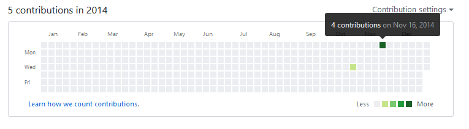

## Vulnerable Contributions

This repository was made to show that the Github feature "Contributions" aka. green dots can't be trusted in term of "Timestamping", this is due to the nature of Git.

This repository is initialized and pushed on 4/9/2018 while it's commit(s) say it was created back in 2014 and **it shows in the contribution graph**.

### How-to

Simply add the ``--date`` and ``GIT_COMMITTER_DATE`` global variable parameter when doing commits, eg:
```
GIT_COMMITTER_DATE="Wed Nov 16 14:00 2014 +0100"
git commit -a --date="Wed Nov 16 14:00 2014 +0100"
```


BINGO!



### References 
[How can one change the timestamp of an old commit in Git?](https://stackoverflow.com/a/5017265/2073933)

